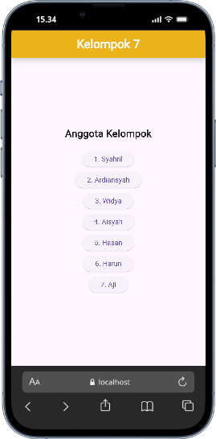
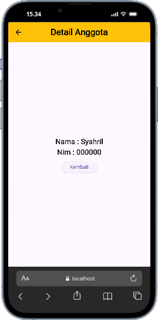

# Tugas 2 - Aplikasi Flutter Kelompok 7

Aplikasi Flutter sederhana yang menampilkan daftar nama anggota kelompok 7.

## 📜 Deskripsi

Aplikasi ini dibuat untuk memenuhi tugas 2 mata kuliah Pemrograman Android. Aplikasi ini menampilkan daftar nama anggota kelompok 7, dan ketika salah satu nama di klik, maka akan menampilkan halaman detail yang berisi nama dan NIM anggota tersebut.

## ✨ Fitur

*   Menampilkan daftar nama anggota kelompok.
*   Menampilkan halaman detail anggota dengan informasi nama dan NIM.
*   Navigasi antar halaman.

## ⚙️ Prasyarat

Pastikan Anda telah menginstal Flutter di lingkungan pengembangan Anda. Untuk informasi lebih lanjut tentang cara menginstal Flutter, silakan merujuk ke [dokumentasi resmi Flutter](https://flutter.dev/docs/get-started/install).

## 🚀 Instalasi

1.  **Clone repositori:**
    ```bash
    git clone https://github.com/avhan052-arch/tugas2.git
    ```
2.  **Masuk ke direktori proyek:**
    ```bash
    cd tugas2
    ```
3.  **Instal dependensi:**
    ```bash
    flutter pub get
    ```

## 🏃‍♂️ Menjalankan Aplikasi

1.  **Pastikan perangkat (emulator atau perangkat fisik) terhubung.**
2.  **Jalankan aplikasi:**
    ```bash
    flutter run
    ```

## 📸 Screenshot

| Halaman Utama | Halaman Detail |
| :---: | :---: |
|  |  |

## 👥 Anggota Kelompok 7

*   Syahril (000000)
*   Ardiansyah (000001)
*   Widya (000002)
*   Aisyah (000003)
*   Hasan (000004)
*   Harun (000005)
*   Aji (000006)